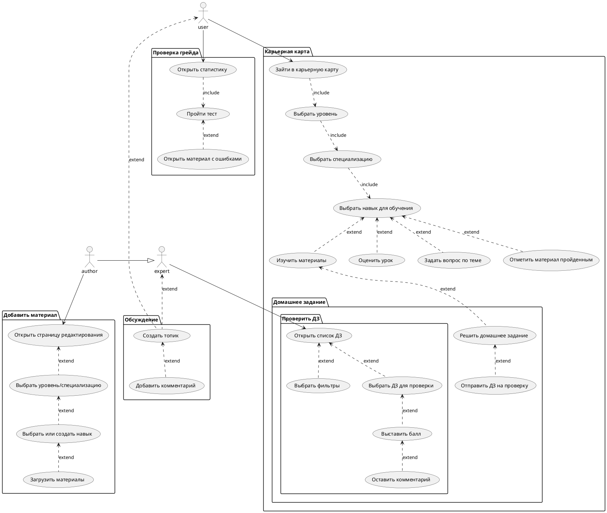
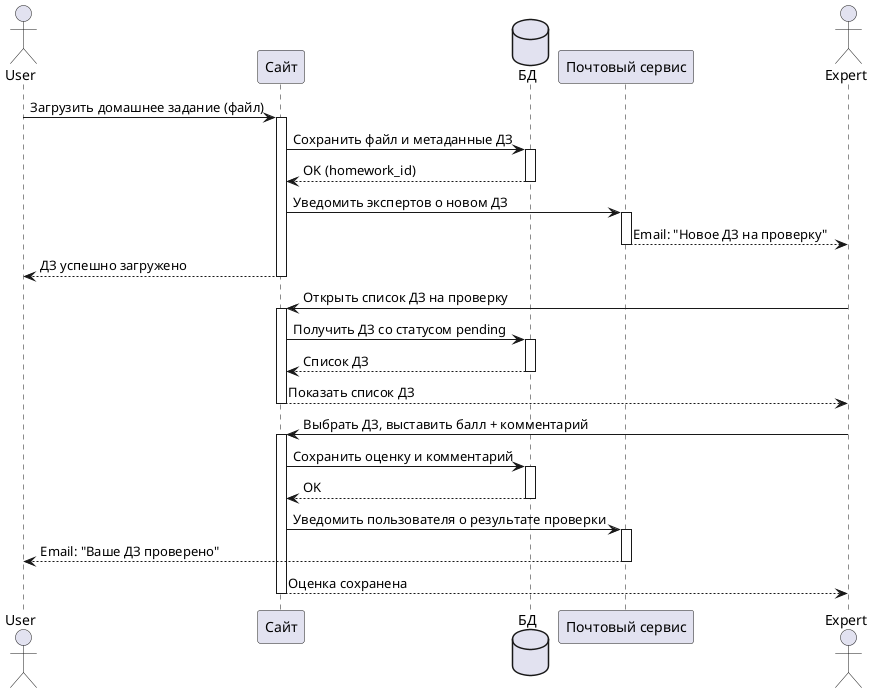

# Пользовательские сценарии

## Диаграмма прецедентов (Use Case)

Диаграмма описывает взаимодействие трёх ролей с функциями системы: **User** (пользователь), **Expert** (эксперт) и **Author** (автор контента).

---

## Sequence-диаграмма: загрузка домашнего задания

Диаграмма описывает поток взаимодействий при отправке и проверке домашнего задания.

---

## Sequence-диаграмма: выбор специализации и прохождение урока

> **Шаблон раздела.** Детальная диаграмма добавляется по мере проработки соответствующего потока.

Основные шаги:
1. Пользователь выбирает специализацию из списка (`GET /specializations`)
2. Просматривает материалы специализации (`GET /specializations/{id}/materials`)
3. Открывает конкретный урок (`GET /specializations/{id}/materials/{material_id}`)
4. Отмечает урок как пройденный (`POST /materials/{id}/complete`)
5. Оставляет оценку уроку (`POST /materials/{id}/rate`)
